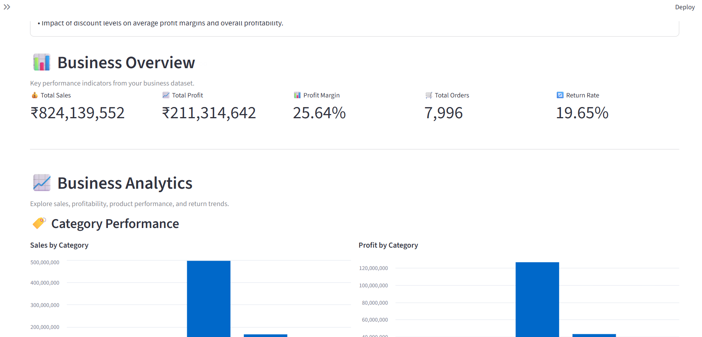
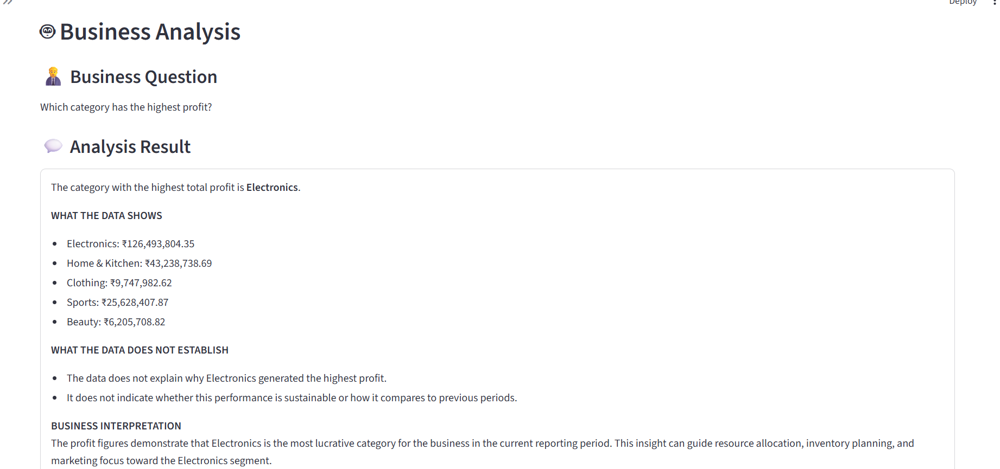
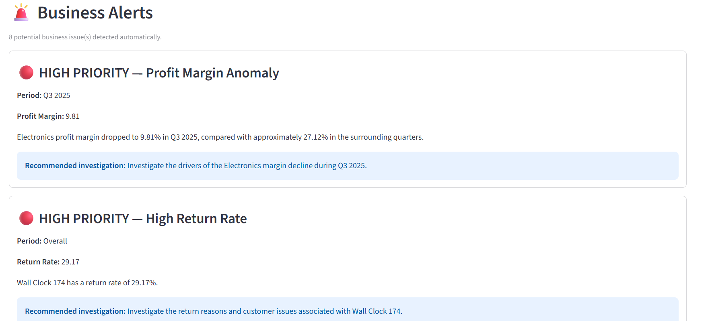

# InsightRAG – AI Business Analyst

> An AI-powered business analytics platform that combines **data analysis, interactive dashboards, anomaly detection, marketing analytics, executive insights, and Retrieval-Augmented Generation (RAG)** into one Streamlit application.

---

## 📌 Overview

**InsightRAG** is a business intelligence and AI analytics application designed to simulate the workflow of an AI Business Analyst.

The project combines traditional data analytics with a grounded RAG pipeline so that users can:

- Explore business performance through interactive dashboards
- Filter data dynamically
- Analyze sales, profit, margins, customers, products, and categories
- Detect unusual business patterns and anomalies
- Analyze marketing campaign performance and ROI
- Generate executive-level business insights
- Ask natural-language business questions
- Maintain context across follow-up questions
- Retrieve relevant business knowledge before generating AI responses
- Keep AI answers grounded in the available business data and knowledge base

The goal was not simply to build another dashboard, but to create an end-to-end system that connects **data → analytics → retrieval → AI reasoning → business insights**.

---

# 🎯 Problem Statement

Traditional dashboards provide charts and KPIs, but business users often still need to manually interpret the information.

For example:

> "Which category generated the highest profit?"

A dashboard can display the answer.

But the next question may be:

> "What is its profit margin?"

A useful AI Business Analyst should understand that **"its" refers to the category from the previous question**, retrieve the relevant information, and answer within the context of the conversation.

InsightRAG addresses this by combining:

**Structured Data + Analytics + RAG + Conversational Context + AI**

---

# 🚀 Key Features

## 1. Business Overview Dashboard

The application provides a high-level view of business performance through:

- Total Sales
- Total Profit
- Profit Margin
- Total Orders
- Return Rate
- Sales by Category
- Profit by Category
- Monthly Sales Trends
- Monthly Profit Trends
- Top Products by Profit
- Top Products by Return Rate

The dashboard automatically updates based on the selected filters.

---

## 2. Interactive Business Filters

Users can filter the dataset using:

- Date Range
- Product Category
- Customer Segment

These filters affect:

- Business Overview
- Business Analytics
- Visual Insights
- AI Business Analyst responses

This allows users to investigate specific portions of the business instead of relying only on company-wide metrics.

### Example

A user can analyze:

**Electronics + Budget Customers + January 2024 to June 2025**

and receive updated:

- Sales
- Profit
- Margin
- Orders
- Return Rate

for only that filtered population.

---

# 🤖 AI Business Analyst

The AI Business Analyst allows users to ask questions in natural language.

Examples:

- Which category has the highest profit?
- What is its profit margin?
- Which customer segment generates the most profit?
- Which products have the highest return rates?
- What happened to Electronics in Q3 2025?
- Which marketing channel has the highest ROI?
- What are the biggest business problems?
- Show me the monthly sales trend.
- Which products should be investigated for high returns?

The system combines retrieval, analytics, conversation history, and AI generation to produce business-oriented responses.

---

# 🧠 Retrieval-Augmented Generation (RAG)

InsightRAG uses a RAG pipeline to ground AI responses in the project's business knowledge.

### RAG Flow

User Question

→ Query Processing

→ Semantic Retrieval

→ Relevant Business Context

→ Conversation Context

→ AI Model

→ Grounded Business Answer

The retrieval system uses:

- Sentence Transformers
- FAISS
- Persistent vector storage
- Business knowledge documents
- Metadata associated with retrieved chunks

The system retrieves relevant information before sending context to the language model.

---

# 🔎 Grounded AI Design

The AI system is intentionally designed to reduce unsupported answers.

The prompt instructs the model to:

- Use only the provided business context
- Avoid inventing facts or numbers
- Avoid inventing causes
- Distinguish between what the data shows and what requires further investigation
- Connect recommendations directly to available evidence
- Use previous conversation context when resolving follow-up questions

This is especially important for business analytics because an AI-generated explanation should not be presented as a factual business finding unless the available data supports it.

---

# 💬 Conversational Memory

InsightRAG supports session-level conversational memory.

For example:

**Question 1**

"Which category has the highest profit?"

**Answer**

"Electronics."

The user can then ask:

**Question 2**

"What is its profit margin?"

The application understands that **"its" refers to Electronics** and resolves the follow-up question using the previous conversation context.

The system stores recent conversation turns containing:

- User question
- Resolved question
- Assistant answer
- Detected referent
- Query type

The memory is session-based and resets when the Streamlit session is restarted.

---

# 📊 Business Analytics

The analytics layer uses Python and Pandas to calculate business KPIs and generate visualizations.

### Core Metrics

- Sales
- Cost
- Profit
- Profit Margin
- Orders
- Returns
- Return Rate
- Customer Segment Performance
- Product Performance
- Category Performance
- Monthly Trends

---

# 🚨 Anomaly Detection

InsightRAG includes a dedicated anomaly detection module that identifies unusual business patterns.

The current system detects **8 business anomalies**.

### Examples

#### Electronics Margin Anomaly

Electronics experienced a significant margin decline during Q3 2025.

- Q3 2025 Margin: **9.81%**
- Surrounding quarter margins were approximately **27%**

This creates a clear business investigation area.

---

### High Return-Rate Products

The system identifies products with unusually high return rates.

Examples include:

- Wall Clock — 29.17%
- Resistance Bands — 29.11%
- FitWatch Pro — 27.85%
- Sports Backpack — 27.27%
- Pulse X — 26.83%
- BassMax — 25.61%

These are flagged for further investigation.

---

### Monthly Profit Drop

The system also detected a:

**30.3% monthly profit decline from June 2025 to July 2025.**

---

### Discount Profit Risk

The analytics layer identifies a relationship between higher discount levels and lower average profit margins.

The observed difference between the highest and lowest discount levels was:

**45.40 percentage points.**

The application treats this as an investigation signal rather than automatically assigning a specific causal explanation.

---

# 💼 Executive Insights

The project includes an executive insight generation module designed to convert analytical results into concise business-oriented findings.

The executive insight system produces:

### Executive Summary

A high-level overview of the current business situation.

### Key Business Findings

Important observations supported by the available data.

### Top Priorities

Business areas that require attention based on detected patterns.

### Investigation Areas

Specific areas where additional investigation may be useful.

The system avoids presenting unsupported explanations as facts.

---

# 📣 Marketing Analytics

InsightRAG includes a dedicated marketing analytics module based on campaign-level data.

The dataset contains:

**40 marketing campaigns**

### Overall Marketing Performance

- Total Campaign Cost: **₹10,785,884.89**
- Total Revenue: **₹27,904,098.79**
- Overall ROI: **158.71%**
- Average Campaign ROI: **183.24%**
- Average Campaign Duration: **19.48 days**

---

## Marketing Channel Analysis

Aggregated ROI across the evaluated channels:

| Channel | Aggregated ROI |
|---|---:|
| Influencer Marketing | 321.56% |
| Email | 152.64% |
| Affiliate Marketing | 143.43% |
| Search Ads | 142.11% |
| Social Media | 74.44% |

The application can use these metrics to compare campaign channels and identify areas for further analysis.

---

## Campaign Performance Classification

Campaigns are also grouped into performance categories.

| Performance Type | ROI |
|---|---:|
| High | 475.48% |
| Average | 145.05% |
| Poor | 2.42% |

The dataset contains:

**11 Poor-performing campaigns.**

---

# 📈 Visual Insights

InsightRAG includes a visual insight router that selects relevant visualizations based on the user's question.

For example:

### Return-related Questions

→ Top products by return rate

### Customer / Segment Questions

→ Profit by customer segment

### Trend / Monthly Questions

→ Monthly sales and profit trends

### Product Questions

→ Top products by sales and profit

### Category Questions

→ Sales and profit by category

This allows natural-language questions to connect directly to the most relevant analytical visualization.

---

# 📊 Example Business Findings

The current dataset produces several useful findings.

### Highest Sales / Profit Category

**Electronics**

- Sales: **₹496,988,490.06**
- Profit: **₹126,493,804.35**

---

### Highest-Profit Customer Segment

**Regular**

- Profit: **₹116,585,979.31**

---

### Electronics Q3 2025

- Sales: **₹58,396,436.58**
- Cost: **₹52,669,906.50**
- Profit: **₹5,726,530.08**
- Profit Margin: **9.81%**

For comparison:

- Q2 2025 Margin: **27.66%**
- Q4 2025 Margin: **26.58%**

This makes Q3 2025 an important period for further investigation.

---

# 🧮 Dataset

InsightRAG uses a generated retail business dataset designed to simulate a realistic analytical environment.

| Dataset | Records |
|---|---:|
| Customers | 2,000 |
| Products | 250 |
| Orders | 10,000 |
| Order Items | 20,118 |
| Marketing Campaigns | 40 |

The generated dataset contains multiple business dimensions including:

- Customer information
- Product information
- Categories
- Orders
- Order items
- Returns
- Marketing campaigns

The data pipeline also performs validation checks such as:

- Duplicate ID checks
- Invalid foreign key checks
- Missing value checks

---

# 📊 Overall Business Metrics

The complete dataset currently produces:

| Metric | Value |
|---|---:|
| Total Sales | ₹824,139,552 |
| Total Profit | ₹211,314,642 |
| Profit Margin | 25.64% |
| Total Orders | 10,000 |
| Return Rate | 17.21% |

These values represent the generated dataset used by the application.

---

# 🏗️ System Architecture

The project follows a modular architecture separating:

**Application Layer**

→ Streamlit UI

**Analytics Layer**

→ Business KPIs  
→ Anomaly Detection  
→ Executive Insights  
→ Marketing Analytics

**RAG Layer**

→ Document Preparation  
→ Embedding Generation  
→ Vector Store  
→ Retrieval  
→ RAG Pipeline

**Data Layer**

→ Raw Data  
→ Cleaning  
→ Processed Data  
→ Knowledge Base

**AI Layer**

→ Groq Language Model  
→ Grounded Prompting  
→ Conversational Context

---

# 🔄 End-to-End Data Flow

Raw Data

→ Data Generation

→ Data Cleaning

→ Processed CSV Files

→ Analytics Modules

→ Business Insights

→ Knowledge Base Preparation

→ Text Chunking

→ Embeddings

→ FAISS Vector Store

→ Retrieval

→ Context Assembly

→ AI Model

→ Business Answer

---

# 🧱 Analytics Architecture

The analytics functionality is separated into independent modules.

### Data Layer

`src/data/`

Responsible for:

- Data generation
- Data cleaning
- Data preparation

### Analytics Layer

`src/analytics/`

Responsible for:

- Anomaly detection
- Executive insights
- Marketing analytics
- Marketing AI
- Insight generation

### RAG Layer

`src/rag/`

Responsible for:

- Document preparation
- Embedding
- Vector storage
- Retrieval
- RAG pipeline

### Application Layer

`app/`

Contains the Streamlit application.

---

# 📁 Project Structure

    InsightRAG/
    │
    ├── app/
    │   └── streamlit_app.py
    │
    ├── data/
    │   ├── knowledge_base/
    │   ├── processed/
    │   ├── raw/
    │   └── vector_store/
    │
    ├── notebooks/
    │   └── 01_exploratory_data_analysis.ipynb
    │
    ├── src/
    │   ├── analytics/
    │   │   ├── anomaly_detector.py
    │   │   ├── executive_insights.py
    │   │   ├── generate_insights.py
    │   │   ├── marketing_analytics.py
    │   │   └── marketing_ai.py
    │   │
    │   ├── data/
    │   │   ├── clean_data.py
    │   │   └── generate_data.py
    │   │
    │   └── rag/
    │       ├── prepare_documents.py
    │       ├── rag_pipeline.py
    │       ├── retriever.py
    │       └── vector_store.py
    │
    ├── .gitignore
    ├── requirements.txt
    └── README.md

---

# 🛠️ Tech Stack

## Programming

- Python

## Data Analysis

- Pandas
- NumPy
- Matplotlib
- Seaborn

## Business Intelligence

- Streamlit
- Altair

## RAG / AI

- Sentence Transformers
- FAISS
- Groq
- `openai/gpt-oss-20b`

## Data Generation

- Faker

## Development

- Jupyter
- Python virtual environment
- Git
- GitHub

---

# ⚙️ Installation

Clone the repository:

    git clone https://github.com/kartikeyaPandey1/-InsightRAG.git

Move into the project directory:

    cd .\-InsightRAG

Create a virtual environment:

    python -m venv .venv

Activate the environment on Windows PowerShell:

    .\.venv\Scripts\Activate.ps1

Install dependencies:

    pip install -r requirements.txt

---

# 🔐 Environment Variables

Create a `.env` file in the project root.

Add:

    GROQ_API_KEY=your_groq_api_key

The `.env` file should not be committed to GitHub.

It is already excluded through `.gitignore`.

---

# ▶️ Running the Application

From the project root:

    $env:STREAMLIT_SERVER_FILE_WATCHER_TYPE="none"
    python -m streamlit run app\streamlit_app.py

The application will start locally using Streamlit.

---

# 🔄 Data Pipeline

The project includes a complete data generation and processing pipeline.

### Step 1 — Generate Data

The synthetic business datasets are generated programmatically.

### Step 2 — Clean Data

The generated datasets are cleaned and validated.

### Step 3 — Prepare Knowledge Base

Business information is converted into documents suitable for retrieval.

### Step 4 — Generate Embeddings

Sentence Transformers converts text chunks into vector representations.

### Step 5 — Build Vector Store

FAISS stores the vectors for semantic retrieval.

### Step 6 — Retrieve Relevant Context

When a user asks a question, the system retrieves the most relevant business knowledge.

### Step 7 — Generate AI Response

The retrieved context, analytical information, and conversation history are provided to the language model.

---

# 🧠 Engineering Decisions

## Why RAG?

A normal LLM can generate fluent answers, but it does not automatically know the specific business dataset used by this application.

RAG provides a mechanism for retrieving relevant project-specific information before generating a response.

---

## Why FAISS?

FAISS provides efficient local vector similarity search and allows the project to maintain a persistent vector store without requiring a separate hosted vector database.

---

## Why Sentence Transformers?

Sentence Transformers provides local text embeddings that can be generated without relying on a paid external embedding API.

---

## Why Streamlit?

Streamlit makes it possible to turn the analytics and AI pipeline into an interactive business application without requiring a separate frontend framework.

---

## Why Modular Architecture?

The project separates:

- Data processing
- Analytics
- RAG
- AI generation
- Application UI

This makes individual components easier to understand, test, and modify.

---

# 🧪 Validation

The project includes validation and testing of important components.

Examples include:

- Data integrity checks
- Duplicate ID validation
- Foreign key validation
- Missing value checks
- RAG retrieval testing
- Filtered analytics validation
- Conversation follow-up testing
- Anomaly detection validation
- Marketing analytics validation

The Streamlit application was also tested with the full dataset and filtered datasets.

---

# 💡 Example Questions

You can ask the AI Business Analyst questions such as:

    Which category has the highest profit?

    What is its profit margin?

    Which customer segment generates the most profit?

    Which products have the highest return rates?

    What happened to Electronics in Q3 2025?

    Which marketing channel has the highest ROI?

    What are the biggest business problems?

    Show me the monthly sales trend.

    Which category has the highest sales?

    Which products should be investigated for high returns?

    What are the key business findings?

---

# 🔍 Filtered Analysis Example

The application allows users to combine filters.

For example:

**Category:** Electronics  
**Customer Segment:** Budget  
**Date Range:** January 2024 – June 2025

The filtered dataset contains approximately:

- 749 records
- Sales: ₹96.81M
- Profit: ₹26.26M
- Profit Margin: 27.13%
- Orders: 611
- Return Rate: 8.84%

The AI Business Analyst can then answer questions using the filtered business context.

---

# 🧩 Project Capabilities

InsightRAG demonstrates an end-to-end workflow involving:

- Data generation
- Data cleaning
- Exploratory data analysis
- Business KPI calculation
- Interactive dashboards
- Data filtering
- Visualization
- Anomaly detection
- Marketing analytics
- Executive reporting
- Semantic search
- Vector databases
- Retrieval-Augmented Generation
- Conversational AI
- Context resolution
- Grounded AI responses
- Modular Python architecture

---

# 🎯 What This Project Demonstrates

This project brings together several skills relevant to modern Data Analyst, Analytics Engineer, and AI-enabled software roles.

### Data Analytics

- Python
- Pandas
- NumPy
- Data cleaning
- Exploratory analysis
- KPI development
- Business analysis

### Visualization

- Streamlit
- Altair
- Matplotlib
- Seaborn

### SQL / Data Thinking

The project is designed around business questions involving:

- Aggregation
- Segmentation
- Trends
- Profitability
- Returns
- Campaign performance

### AI Engineering

- Embeddings
- Semantic retrieval
- FAISS
- RAG
- Prompt grounding
- Conversational context
- LLM integration

### Software Engineering

- Modular project structure
- Reusable Python modules
- Separation of concerns
- Environment variables
- Git/GitHub
- Virtual environments

---

# 📸 Screenshots

## Business Overview

The main dashboard provides an overview of business performance including KPIs, sales, profit, margins, orders, returns, and category-level analytics.

---

## AI Business Analyst

The AI Business Analyst allows users to ask natural-language business questions and supports conversational follow-up questions using session-level context.

---

## Anomaly Detection

InsightRAG automatically identifies unusual business patterns such as margin anomalies, high-return products, monthly profit drops, and discount-related profit risks.

# 🔮 Future Improvements

Potential future improvements include:

- More advanced RAG reranking
- Hybrid keyword + semantic retrieval
- Persistent conversational memory
- Additional business datasets
- Automated report generation
- Exportable business reports
- More advanced anomaly detection
- Additional marketing attribution analysis
- SQL-backed analytics
- Role-based dashboards
- Cloud deployment
- Automated data refresh pipelines
- More advanced evaluation of RAG responses

---

# 🏁 Project Status

**Completed Portfolio Project**

The current version includes:

- Interactive business dashboard
- Dynamic filtering
- Business analytics
- AI Business Analyst
- RAG pipeline
- Conversational memory
- Anomaly detection
- Executive insights
- Marketing analytics
- Grounded AI responses
- Persistent FAISS vector store
- Modular Python architecture

---

# 👨‍💻 Author

## Kartikeya Pandey

Electronics & Communication Engineering  
SLIET Longowal

### Links

Portfolio:  
https://my-portfolio-psi-ashy-58.vercel.app/

LinkedIn:  
https://www.linkedin.com/in/kartikeya-pandey-451b97289

GitHub:  
https://github.com/kartikeyaPandey1

---

# ⭐ Why InsightRAG?

InsightRAG was built to explore what happens when traditional business analytics is combined with modern AI retrieval systems.

Instead of treating analytics and AI as separate components, the project connects them into a single workflow:

**Business Data**

→ **Analytics**

→ **Business Findings**

→ **Knowledge Retrieval**

→ **Context**

→ **AI**

→ **Business Answer**

The result is an interactive AI Business Analyst that can work with structured business data, retrieve relevant knowledge, understand conversational follow-ups, identify unusual patterns, and communicate analytical findings through an interactive dashboard.
